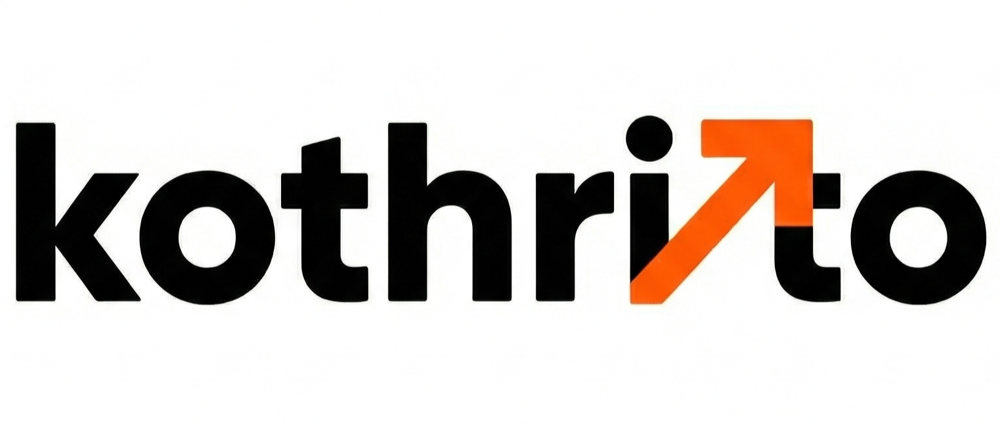

<p align="center">
  
</p>

<h1 align="center">Kothrito</h1>

<p align="center">
  <strong>A hyperlocal ride-hailing & delivery platform built for a campus that had nothing.</strong>
</p>

<p align="center">
  Next.js 16 · Firebase · Leaflet Maps · Real-time Transactions · TypeScript
</p>

---

## Why This Exists

VIT Bhopal sits in **Kothri Kalan** — a village in Madhya Pradesh where Rapido doesn't operate, Zomato doesn't deliver, and Blinkit has never heard of. Students walk 3 kilometers to class in 45°C heat. Local auto-rickshaws charge whatever they want. There is no food delivery infrastructure. There is no grocery delivery. The nearest city — Bhopal — is a 2-hour bus ride away.

**Kothrito** is what happens when you refuse to accept that.

The name comes from **Kothri Kalan** itself — the village the college calls home. The project was designed to solve three real problems simultaneously:

1. **Students** needed affordable, reliable rides within campus and to nearby areas
2. **Local villagers** needed a earning opportunity — a fleet of riders who could serve the campus
3. **Food and grocery delivery** simply didn't exist here — no aggregator would invest in a rural campus with 3,000 students

Kothrito is a single platform that replaces Rapido, Zomato, and Blinkit for a community that was underserved by all three.

---

## What It Does

Three apps. One backend. Real-time everything.

| App | Route | Who It's For |
|---|---|---|
| **Student Portal** | `/` | Students ordering rides, food, or groceries |
| **Rider Dashboard** | `/kothrito-rider` | Local villagers fulfilling orders |
| **Admin Control Panel** | `/admin-kothrito` | Platform operator managing the entire system |

### Student Portal (`/`)

The consumer-facing Progressive Web App — designed to feel like a native app on any phone.

- **One-tap anonymous login** — no sign-up friction. Students open the link and start ordering.
- **Three services, one interface** — Bike Rides, Food Delivery, Grocery Delivery. Tap a card, drop a pin, done.
- **Interactive satellite map** — Leaflet with Google Satellite Hybrid tiles. Students place pickup and drop pins visually on a real map of campus.
- **Dynamic distance pricing** — Haversine formula calculates road distance between pins. Fare is computed in real-time: `Base Fare + (Km × Per KM Rate) × Surge Multiplier`. Prices update instantly when the admin adjusts rates.
- **Restaurant browsing** — View online campus restaurants, browse menu images in a horizontal scroller, type custom orders ("2x Masala Dosa, 1x Cold Coffee, less sugar").
- **Quick location chips** — Admin-configurable shortcuts for Hostel 1, Academic Block, Main Gate, etc. One tap fills the address field.
- **Real-time order tracking** — Firestore `onSnapshot` listeners. When a rider accepts, the student instantly sees the rider's name, phone, and a live status update.
- **Post-trip feedback** — 1-5 star rating modal with text review. Driver quality stays high because accountability is built in.
- **Dark mode** — Full system-wide dark theme, persisted across sessions.
- **Service kill switch** — When the admin disables operations, students see a clean "Service is Resting" screen instead of a broken app.

### Rider Dashboard (`/kothrito-rider`)

A mobile-first command center built for riders who may be using the app for the first time in their lives.

- **Fleet authorization** — Only pre-approved riders (by admin email) can access this portal. Everyone else sees "Missing Fleet Privileges."
- **Duty toggle** — "ON DUTY" / "OFF DUTY" — riders control when they're available. No orders appear when they're off duty.
- **Live job pool** — All pending orders visible in real-time, categorized by type (Ride / Food / Grocery) with the fare amount displayed prominently.
- **Race-condition-safe acceptance** — When a rider taps "Accept Job," a Firestore `runTransaction` atomically locks the order. If two riders tap simultaneously, only one wins. The other gets a clear "Too slow!" message with an error vibration — no confusion, no double-assignments.
- **Active run mode** — Once a job is accepted, the UI strips to essentials: student name, pickup/drop coordinates, one-tap call, WhatsApp message, Google Maps navigation, and the "Finish Ride" button.
- **WhatsApp integration** — Pre-filled "I am on my way" message to the student. No copy-pasting.
- **Google Maps navigation** — Direct deep-links to Google Maps for "Navigate to Pickup" and "Navigate to Drop."
- **Emergency SOS** — One-tap emergency button that flags the order and dials the admin emergency line. Safety net for riders operating in unfamiliar areas.
- **Income tracking** — Today's earnings, weekly total, lifetime total. Riders see exactly how much they've made.
- **Review feed** — Recent student ratings and reviews. Riders see their reputation building in real-time.
- **Hindi language toggle** — Full interface translation to Hindi (`अ`). Every rider can use the app in their native language.
- **Haptic + audio feedback** — Success chime when a job is claimed. Error vibration when beaten to a job. Sensory confirmation that matters on a noisy campus.

### Admin Control Panel (`/admin-kothrito`)

The command center. Hardcoded to a single authorized email. Full platform control.

- **Route lockout** — Non-admins see "Access Denied: Master Admin database privileges missing." No way around it.
- **Live watchlist** — Real-time ledger of all active and pending orders. New inbound orders trigger an audio bell and device vibration — the admin always knows.
- **Revenue analytics** — Revenue breakdown by Today, This Week, This Month, This Year, and All Time. One glance tells you how the platform is performing.
- **Global pricing engine** — Edit Base Fare, Per KM Rate, and Surge Multiplier live. Changes propagate instantly to every student's pricing calculation. No redeployment needed.
- **Quick locations manager** — Add, edit, or remove the shortcut chips that appear on the student map picker. Campus landmarks evolve — the app adapts.
- **Kill switch** — Single toggle to flip the entire platform OFF. No new orders can be placed. Useful for emergencies, maintenance, or end-of-semester.
- **Fleet management** — View all riders, toggle their online status, revoke access, delete riders, or onboard new riders instantly via a modal form.
- **Per-rider work history** — Drill into any rider's profile to see every job they've completed, earnings per trip, and service types handled.
- **User directory** — View all registered student profiles with contact information.
- **Restaurant management** — Add or remove campus restaurants, upload menu images, toggle their online status.
- **Complete ride logs** — Paginated view of every historical transaction across the platform.
- **CSV export** — One-click export of the entire ride database. Drop it into Excel for accounting, analysis, or reporting.
- **Feedback matrix** — Review all student ratings and driver notes in one place.

---

## Why This Works

### It solves a real problem

This isn't a clone of Uber for a hackathon. Kothrito was built because no one else would serve this campus. Rapido, Zomato, Swiggy, and Blinkit all have minimum order values and density requirements that rural campuses don't meet. Kothrito was designed from day one for the specific constraints of Kothri Kalan: low bandwidth, mixed Hindi/English users, cash-based payments, and a 3km campus radius.

### It creates economic opportunity

The rider fleet is drawn from the local village. Every completed order puts money directly into a villager's pocket. The platform doesn't take a commission — riders keep 100% of the fare. This was intentional: the goal was to build something that benefits the community, not extract from it.

### It's production-grade architecture

The codebase isn't a prototype. It handles the exact problems that kill real ride-hailing apps:

- **Double-booking prevention** — Firestore transactions ensure only one rider can claim an order, even under high concurrency.
- **Real-time state management** — Zero polling. Firestore `onSnapshot` listeners power live order tracking, admin monitoring, and rider job pools.
- **Role-based access control** — Three distinct user roles (Student, Rider, Admin) with server-side Firestore security rules enforcing authorization at the database level.
- **Dynamic pricing** — Admin-controlled surge pricing, base fares, and per-km rates that update the entire platform instantly.
- **Offline-aware UX** — Anonymous auth for zero-friction student onboarding. Local storage for recent addresses and dark mode preferences.

### It's designed for the real world

- **Hindi language support** — Full bilingual interface for riders who don't think in English.
- **Haptic feedback** — Device vibrations confirm actions on a phone that's vibrating in a pocket during a noisy campus day.
- **WhatsApp integration** — Because that's how India communicates. Pre-filled messages, not custom chat systems.
- **Emergency SOS** — Safety isn't an afterthought. One tap flags the order and connects to the admin.
- **Satellite map view** — Google Satellite Hybrid tiles because campus roads aren't on standard maps. Students need to see actual buildings and landmarks.

---

## Tech Stack

| Layer | Technology | Why |
|---|---|---|
| Framework | Next.js 16 (App Router, React 19) | Server-side rendering, API routes, file-based routing |
| Styling | Tailwind CSS v4 | Utility-first CSS for rapid UI development |
| Icons | lucide-react | Consistent, lightweight iconography |
| Database | Firebase Firestore | Real-time NoSQL with `onSnapshot` listeners |
| Auth | Firebase Authentication | Anonymous auth (students), Google auth (riders/admin) |
| Maps | Leaflet.js + Google Satellite Tiles | Free, open-source, no API key required for tiles |
| Pricing | Haversine formula | Campus-aware distance calculation without paid routing APIs |
| Audio | use-sound + Base64 MP3 | Zero-dependency audio feedback |
| Haptics | `navigator.vibrate` API | Device-native vibration patterns |
| Language | TypeScript 5 | Type safety across a complex multi-role codebase |

---

## Architecture

```
┌─────────────────────────────────────────────────────┐
│                    FIREBASE BACKEND                  │
│  ┌──────────┐  ┌──────────┐  ┌──────────────────┐  │
│  │   Auth   │  │ Firestore│  │ Security Rules   │  │
│  │ Anon/Google│ │ Real-time│  │ Role-based ACL   │  │
│  └──────────┘  └──────────┘  └──────────────────┘  │
└───────────────────────┬─────────────────────────────┘
                        │
          ┌─────────────┼─────────────┐
          │             │             │
    ┌─────▼─────┐ ┌─────▼─────┐ ┌─────▼──────┐
    │  Student  │ │   Rider   │ │   Admin    │
    │  Portal   │ │ Dashboard │ │  Panel     │
    │     /     │ │ /kothrito │ │ /admin-    │
    │           │ │  -rider   │ │  kothrito  │
    └───────────┘ └───────────┘ └────────────┘
     Anonymous     Google Auth   Google Auth
     Auth          (Fleet only)  (Hardcoded)
```

### Order State Machine

```
  Student places order
          │
          ▼
      ┌────────┐
      │PENDING │ ◄── Riders see this in Job Pool
      └───┬────┘
          │  Rider taps "Accept" (runTransaction)
          ▼
     ┌─────────┐
     │ACCEPTED │ ◄── Student sees rider name + phone
     └───┬─────┘
          │  Rider completes trip
          ▼
    ┌──────────┐
    │COMPLETED │ ◄── Rating modal appears for student
    └───┬──────┘
          │  Student submits feedback
          ▼
     ┌────────┐
     │ RATED  │ ◄── Order enters analytics
     └────────┘
```

---

## Database Schema

### `users`

| Field | Type | Description |
|---|---|---|
| `id` | string | Firebase Auth UID |
| `name` | string | Display name |
| `phone` | string | WhatsApp number (+91 format) |
| `createdAt` | timestamp | Account creation time |

### `riders`

| Field | Type | Description |
|---|---|---|
| `id` | string | Lowercased Google email (document key) |
| `name` | string | Rider name |
| `email` | string | Google email |
| `phone` | string | Contact number |
| `role` | string | `"rider"` or `"inactive"` |
| `riderStatus` | boolean | Online/offline duty state |
| `uid` | string | Firebase Auth UID (linked on first login) |
| `createdAt` | timestamp | Authorization time |

### `settings`

| Document | Fields | Description |
|---|---|---|
| `global` | `baseFare`, `perKmRate`, `surgeMultiplier`, `isServiceActive` | Pricing engine + kill switch |
| `appSettings` | `quickLocations` | Shortcut location chips array |

### `orders`

| Field | Type | Description |
|---|---|---|
| `status` | string | `pending` → `accepted` → `completed` → `rated` |
| `serviceType` | string | `"ride"`, `"food"`, or `"grocery"` |
| `price` | number | Calculated fare (₹) |
| `pickup` | object | `{ lat, lng, address }` |
| `drop` | object | `{ lat, lng, address }` |
| `userId` | string | Student Firebase UID |
| `userName` | string | Student display name |
| `userPhone` | string | Student phone |
| `riderId` | string | Rider Firebase UID (set on accept) |
| `riderName` | string | Rider name (set on accept) |
| `riderPhone` | string | Rider phone (set on accept) |
| `restaurantId` | string | Restaurant document ID (food orders) |
| `restaurantName` | string | Restaurant name (food orders) |
| `customOrderText` | string | Free-text order details |
| `rating` | number | 1-5 star rating |
| `review` | string | Text review |
| `rated` | boolean | Feedback submitted flag |
| `sosInitiated` | string | `"rider"` if emergency triggered |
| `createdAt` | timestamp | Order creation time |

### `restaurants`

| Field | Type | Description |
|---|---|---|
| `id` | string | Auto-generated document ID |
| `name` | string | Restaurant name |
| `isOnline` | boolean | Accepting orders flag |
| `menuImages` | string[] | Menu image URLs |

---

## Security Rules

```javascript
// Users: own profile read/write, admin full access
// Settings: public read, admin-only write
// Riders: authenticated read, self-update status, admin write/delete
// Orders: authenticated read, user-created (UID match), admin delete
```

Full rules in [`firestore.rules`](firestore.rules).

---

## Getting Started

### Prerequisites

- Node.js 18+
- Firebase project (Firestore + Authentication enabled)

### Installation

```bash
git clone https://github.com/acaditya10/Kothrito.git
cd Kothrito
npm install
```

### Environment Variables

Create `.env.local`:

```env
NEXT_PUBLIC_FIREBASE_API_KEY=your_api_key
NEXT_PUBLIC_FIREBASE_AUTH_DOMAIN=your_project.firebaseapp.com
NEXT_PUBLIC_FIREBASE_PROJECT_ID=your_project
NEXT_PUBLIC_FIREBASE_STORAGE_BUCKET=your_project.appspot.com
NEXT_PUBLIC_FIREBASE_MESSAGING_SENDER_ID=your_sender_id
NEXT_PUBLIC_FIREBASE_APP_ID=your_app_id
```

### Run

```bash
npm run dev        # Development server
npm run build      # Production build
npm start          # Production server
```

### Admin Access

1. Navigate to `/admin-kothrito`
2. Sign in with Google
3. Your email must match the `ADMIN_EMAILS` array in `app/admin-kothrito/page.tsx:59`

---

## Project Structure

```
kothrito/
├── app/
│   ├── page.tsx                 # Student Portal
│   ├── layout.tsx               # Root layout + Leaflet CSS
│   ├── globals.css              # Tailwind + dark mode variant
│   ├── admin-kothrito/
│   │   └── page.tsx             # Admin Control Panel
│   └── rider/
│       └── page.tsx             # Rider Dashboard
├── components/
│   ├── Branding.tsx             # Shared logo + role badge
│   └── MapPicker.tsx            # Leaflet map + fare calculation
├── hooks/
│   └── useHaptics.ts            # Device vibration patterns
├── lib/
│   ├── firebase.ts              # Firebase initialization
│   └── sounds.ts                # Audio feedback (Base64 MP3)
├── firestore.rules              # Server-side security rules
└── public/
    └── logo.png                 # Brand mark
```

---

## What I Learned Building This

Building something for real users — even before deployment — changes how you think about software:

1. **Transactions aren't optional.** The moment two riders can see the same order, you need `runTransaction` or you'll have double-bookings. This isn't theoretical — it's the first thing that breaks in production.

2. **Hindi isn't a "nice to have."** If your riders don't speak English, your app doesn't work. A language toggle is a product requirement, not a feature.

3. **Maps lie in rural areas.** OSRM snaps pins to distant highways when internal campus roads aren't mapped. The Haversine formula with a road curve multiplier turned out to be more accurate than any routing API for a 3km campus radius.

4. **Anonymous auth removes friction.** Students won't create accounts for a ride. `signInAnonymously` gets them from landing page to order placement in under 10 seconds.

5. **Admin control is the product.** Pricing, fleet access, service status, restaurant management — the admin panel is where the platform actually lives. The student and rider apps are just interfaces to the admin's configuration.

6. **Real-time isn't a feature — it's the baseline.** Firestore `onSnapshot` means zero polling, zero refresh buttons, zero "where's my rider?" anxiety. If your platform isn't real-time, it's not a ride-hailing platform.

---

## License

Private — All rights reserved.
